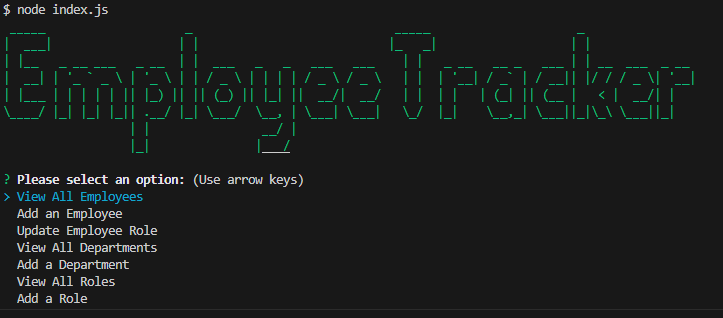
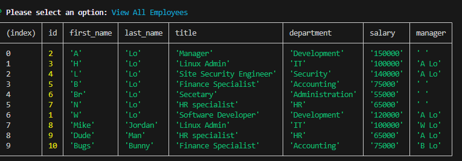
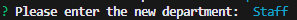

# Employee Tracker Application

## Table of Content
- [Description](#description)
- [Usage](#usage)

## Description
The Employee Tracker Application allows for the user to execute the following options:
View All Employees
Add an Employee
Update Employee Role
View All Departments
Add a Department
View All Roles
Add a Role

- [Demo of Video](https://drive.google.com/file/d/1KjINOTXCeEQvXlWQUx9NTZA1cCRfqksl/view)
- [GitHub Project Repo](https://github.com/whougie/employee-tracker.git)

## Usage
To run the application.  Type the following: node index.js

Once the Employee Tracker Application it will prompt you to select an option:

Selecting an option can display a listing of the option:

Selecting an option can prompt the user to enter some information to execute the option:

